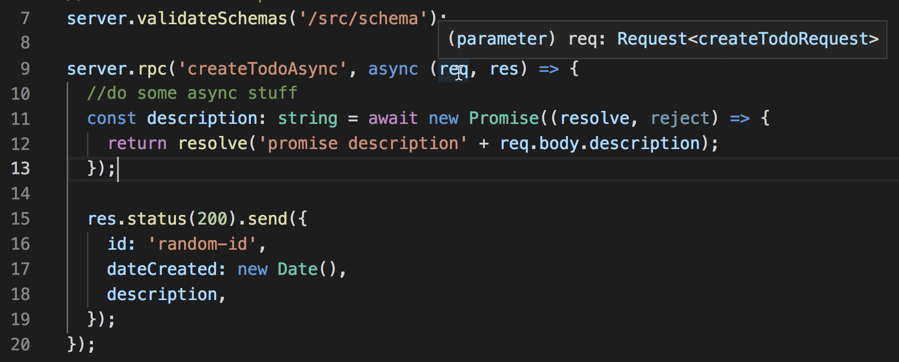
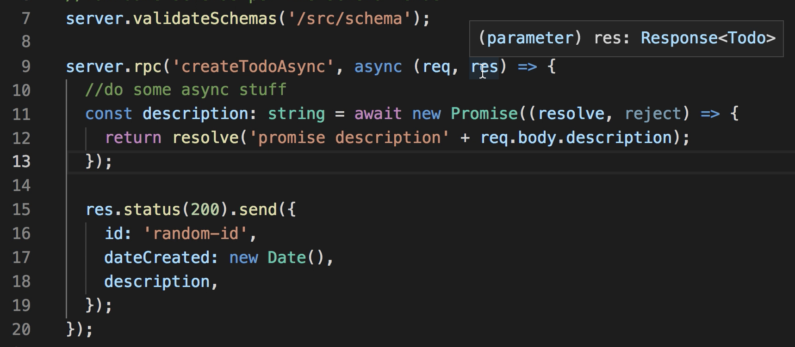
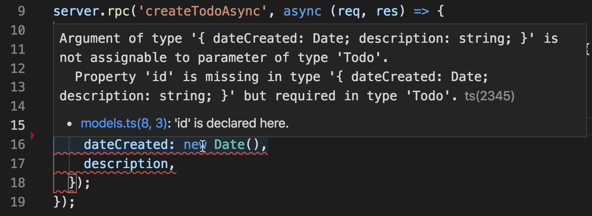

# Typesafe HTTP JSON RPC API with TypeScript


[](https://coveralls.io/github/adcostanza/ts-rpc-http?branch=master)


This small set of utilies makes it very easy to create an RPC API that is definined completely in TypeScript along with a generated client and optional automated api validation.

## Motivation
### Type Hints 
ts-rpc-http gives you type hints for all of your rpc routes on the server, enabling you to 
quickly understand exactly what json body you are receiving.


The response is also typed, ensuring our contract between server and client.


### Type Safety
Beyond the type hints provided, ts-rpc-http also provides safety in that it will alert you
if the response you are sending is invalid per the api contract:


### Automatic Request Validation
By generating JSON schemas, your requests can be automatically validated with a small piece of 
middleware. Below is an example of JSONSchema generation:
```
npx ts-generate --model src/models.ts --schemas
```

### Automatic Client Generation
A client is generated for you that works directly with Promise, making it 
extremely easy to get started on the frontend once the api service is available for consumption. Below is an example client generation command:
```
npx ts-generate --model src/models.ts --clients clients.ts
```

## Model

It all starts with a model file, where you define all of your basic data model types and one or more service definitions with this comment tagging them on the line above `//@http-rpc(<serviceName>)`. Here is a simple example:

```
import { RequestResponse } from 'ts-rpc-http/requestResponse';

export interface createTodoRequest {
  description: string;
}

export interface Todo {
  id: string;
  description: string;
  dateCreated: Date;
}

//@http-rpc(Todo)
export interface ServiceDefinition {
  createTodo: RequestResponse<createTodoRequest, Todo>;
  createTodoAsync: RequestResponse<createTodoRequest, Todo>;
}
```

## Server

The `Server` is a small wrapper around express that provides typing of the request body that is sent in JSON. It also provides optional automatic validation through use of generated JSONSchemas.

If you want to generate JSONSchema files for automatic validation, go ahead and run this command:

```
npx ts-generate --model src/models.ts --schemas
```

Where `src/models.ts` is the location of your models file. A directory called `schema` will be created and schema files will be created for each req/res import of your service.

Now we can create an example service:

```
import { ServiceDefinition } from './models';
import { Server } from 'ts-rpc-http/server';

const server = new Server<ServiceDefinition>();

//validate schemas per the schema folder (optional)
server.validateSchemas('/src/schema');

server.rpc('createTodoAsync', async (req, res) => {
  //do some async stuff
  const description: string = await new Promise((resolve, reject) => {
    return resolve('promise description' + req.body.description);
  });

  res.status(200).send({
    id: 'random-id',
    dateCreated: new Date(),
    description,
  });
});

server.rpc('createTodo', (req, res) => {
  res.status(200).send({
    id: 'random-id',
    dateCreated: new Date(),
    description: req.body.description,
  });
});

server
  .start()
  //no need to log this as it is done by the server automatically with the port
  .then(r => console.log('Started server...'))
  .catch(e => new Error(e));
```

## Client

There is a base `Client` that can be used to make basic calls to the API, but the preferred way is to use the generated clients, making. All you need to do is copy the same models to your frontend and you can generate it there, or generate the clients with the server and provide it as a library.

To generate a client, type the following:

```
npx ts-generate --model src/models.ts --clients clients.ts
```

Which will generate as many clients as you have service definitions and put them in a file called `clients.ts` in the same directory as `src/models.ts` which in this case is `src/`. it may look something like the following:

```
import Client from 'ts-rpc-http/client';
import {
  ServiceDefinition,
  createTodoRequest,
  Todo,
} from './models';

export class TodoClient {
  private client: Client<ServiceDefinition>;
  constructor(baseURL: string) {
    this.client = new Client(baseURL);
  }

  public createTodo = async (
    body: createTodoRequest,
    token?: string
  ): Promise<Todo> => this.client.call('createTodo', body, token);

}
```
